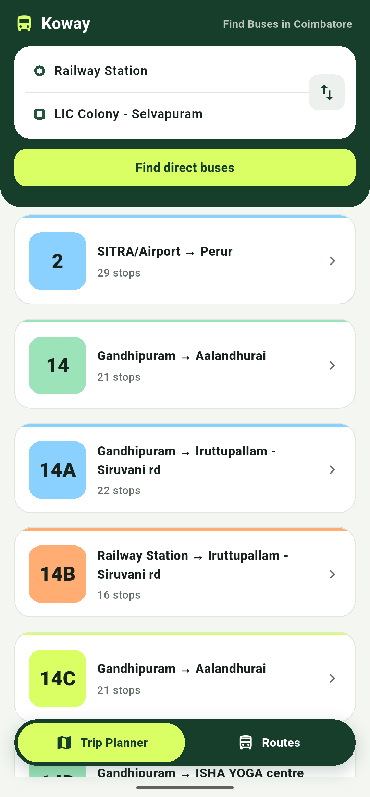
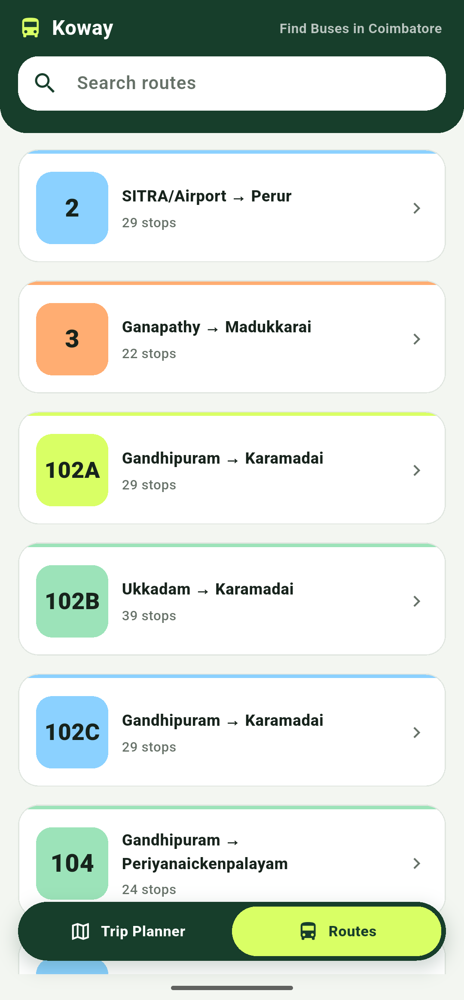
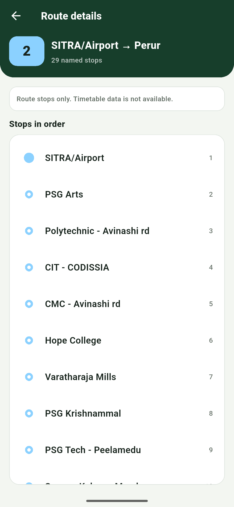

# Koway

Koway is an open-source, community-driven bus route app for Coimbatore, built
with Flutter.

## Features

- Find direct and indirect buses between two stops.
- Search routes by number, origin, or destination.
- View each route's ordered stop list.

Koway currently uses local route data. It does not provide live
tracking, schedules, maps, or estimated arrival times yet.

## Getting Started

Install the [Flutter SDK](https://docs.flutter.dev/get-started/install), then
run the app from the Flutter project folder:

```sh
cd koway
flutter pub get
flutter run
```

To create a production build, choose a target platform:

```sh
flutter build apk
flutter build web
```

## Screenshots

| Trip Planner | Routes | Route Details |
| :---: | :---: | :---: |
|  |  |  |

## Contributing

We are currently accepting changes for adding routes and editing existing
routes. Feel free to add or work on new features and bugs.

## License

The repository, excluding data, and all the code in it is licensed under the
[MIT License](LICENSE).
